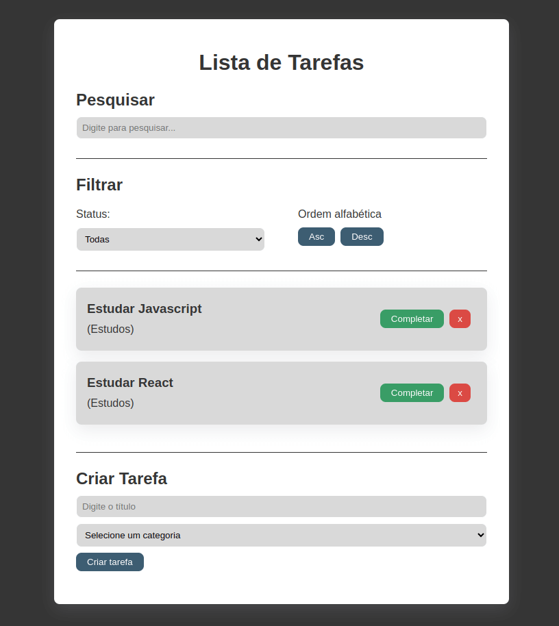

<h1 align="center">Todo List ✔️</h1>

## 💻 Descrição

Um simples lista de tarefas. Nela é possível adicionar novas tarefas, completar as tarefas, excluir tarefas além de pesquisar e ordenar.
## 🚀 Tecnologias

Esse projeto foi desenvolvido com as seguintes tecnologias:

- [React](https://react.dev/)
- [Vite](https://vitejs.dev/)

## 🔖 Screenshots

 

---

Feito por Bruno Duarte